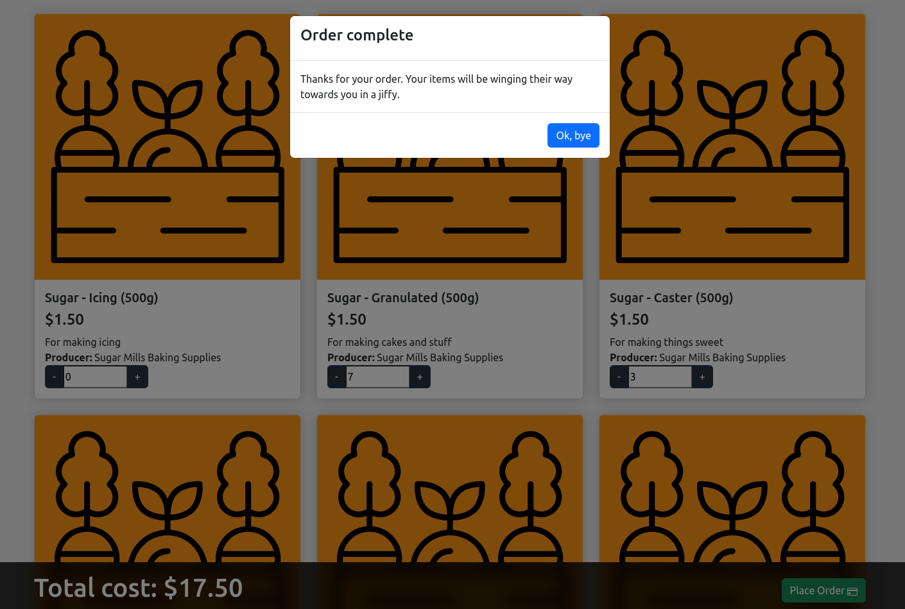

## Notes
* Devise vs JWT
* User vs Producer & Consumer
* Docker
* React experience

### Used:
* Ruby 3.2
* Rails 7
* Node 20
* React 18
* Postgres 15
* Bootstrap 5

### Done:
* Authentication with Devise
* Created Users and Products with seeds.rb
* API endpoints to serve Products and create Orders
* React front-end for listing Products and taking Orders

### Missing:
* JWT (used Devise instead)
* Login managed by Devise instead of via React/API
* No STI
* API endpoint to mark Products inactive
* Deployment to Heroku
* Unit tests
* Search box
* A screen recording
* A sophisticated feature

### Also missing:
* Validation of inputs
* Viewing Orders, adding new Products, etc.
* Handling log in/out well
* Consistent React coding standards

## Running with Docker

```sh
docker-compose -f docker-compose.dev.yml --profile rails up --build
# Then navigate to http://localhost:3000/users/sign_in
# After creating a log-in, navigate to http://localhost:3000/
```

## Screenshot


